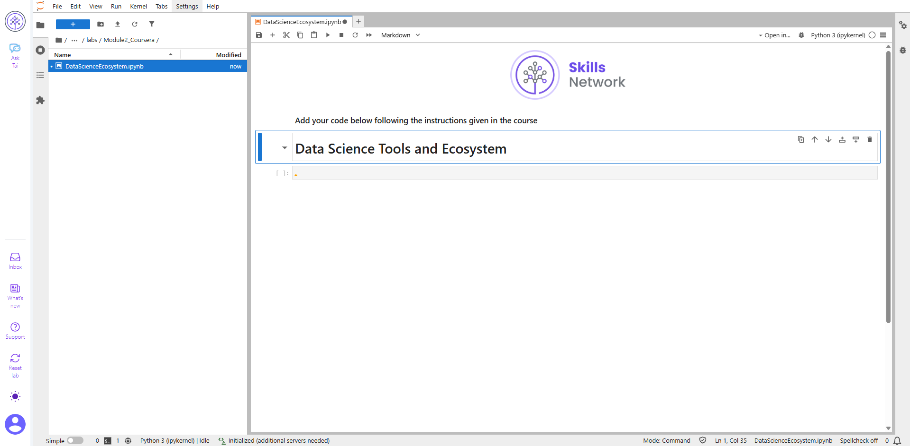
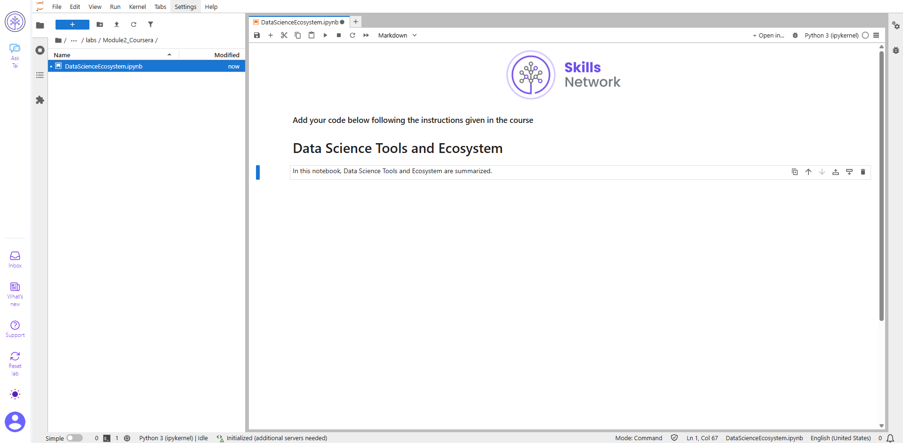
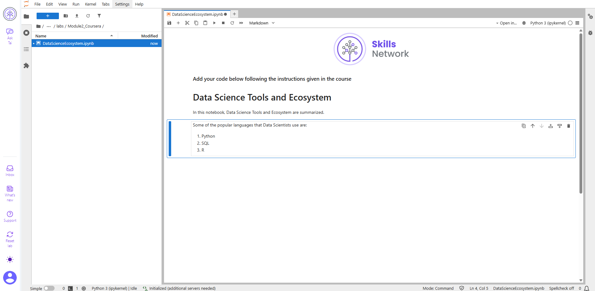
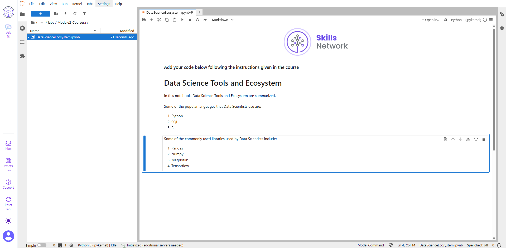
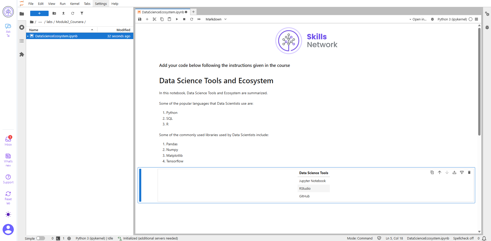
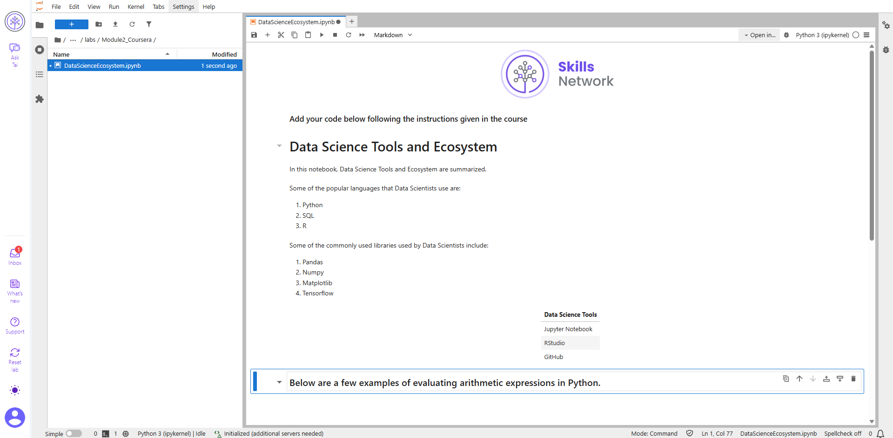
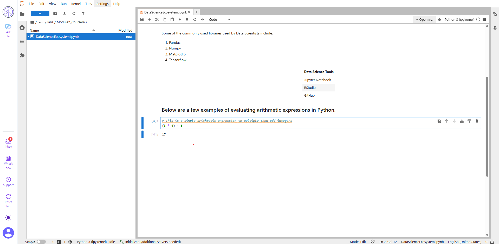
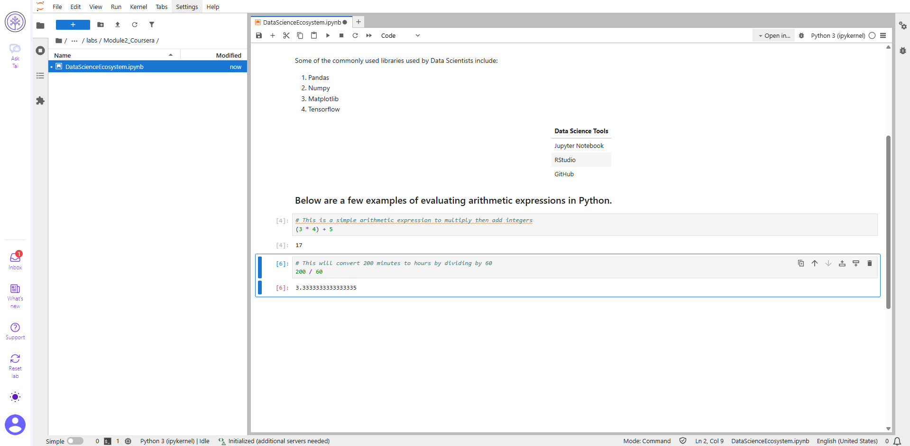
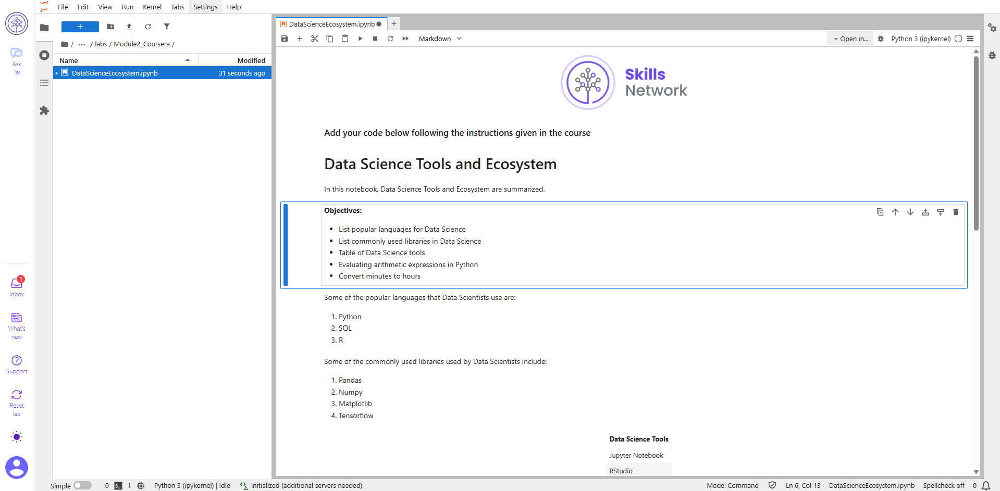
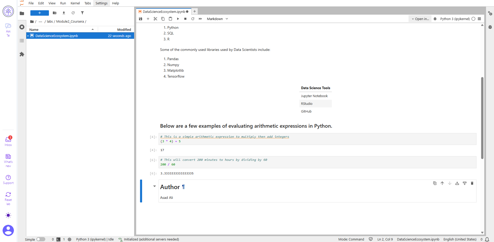

# 📊 Data Science Tools and Ecosystem

This repository contains a Jupyter notebook that provides an overview of some popular tools and concepts used in IBM - Tools for Data Science Course. The notebook includes examples and exercises to help you understand and practice these tools.

## 📚 Contents

The notebook covers the following topics:
- **Languages**: Popular languages for Data Science
- **Libraries**: Commonly used libraries in Data Science
- **Tools**: Open source tools for development environments
- **Arithmetic Expressions**: Examples of evaluating arithmetic expressions in Python
- **Conversions**: Converting time from minutes to hours
- **Objectives**: Key takeaways from the course

## 🚀 Exercises

The notebook includes several exercises to reinforce your learning:
1. Title of the notebook
2. Introduction to the notebook
3. List of popular data science languages
4. List of commonly used data science libraries
5. Table of Data Science tools
6. Examples of arithmetic expressions
7. Converting minutes to hours
8. Listing objectives covered in the notebook
9. Author's information

## 👩‍💻 Author

Asad Ali

## 📷 Screenshots

Screenshots of each exercise are provided for reference:
- 
- 
- 
- 
- 
- 
- 
- 
- 
- 
